# Dropbox-metodi

## Dropboxin autorisointi

Jotta Dropboxista saisi siirrettyä kirjoja lukulaitteeseen, pitää lukulaitteen kautta ensin autorisoida Dropbox-yhteys.

Paina seuraavassa järjestyksessä lukulaitteen kuvakkeita:

1. Apps

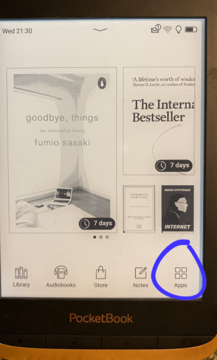

  

2. Settings

  
3. Accounts and synchronization

  
4. Dropbox PocketBook

  

Avautuu näkymä, jossa saat tehtyä autorisoinnin. Kun autorisointi on valmis, edellä mainittujen kuvakkeiden takaa avautuukin nyt seuraava näkymä (folderin nimi voi olla hiukan erilainen omassa laitteessasi):

Nyt kaiken pitäisi olla kunnossa kirjojen siirtoa varten.

## Lainaaminen ja siirto

1.  Loggaa iPhonen Safari-selaimella Vaski Overdriven sivuille. Etsi kirja jonka haluat lainata. Luonnollisestikin tarvitset Vaskin tunnukset.

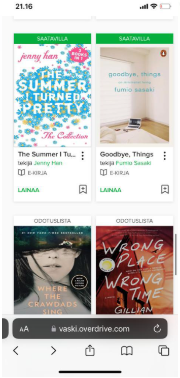
  

2.  Paina "lainaa" ja vielä "lainaa".

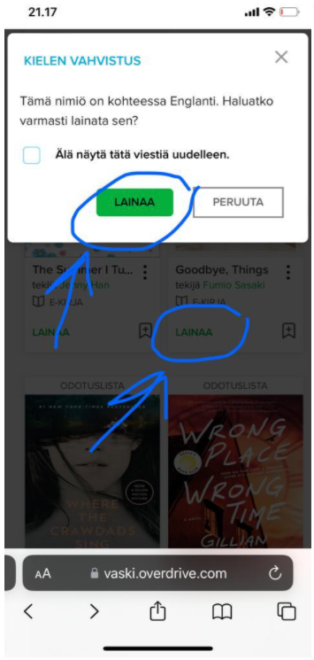
  

3.  Seuraavaksi valitaan haluttu laina-aika ja painetaan taas "lainaa".

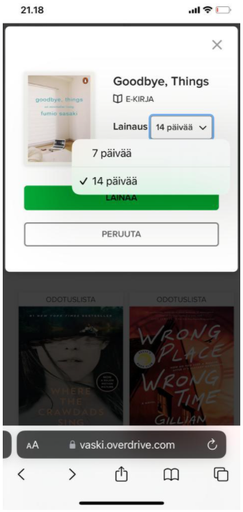
  

4.  Valitaan "Lataa EPUB-kirja".

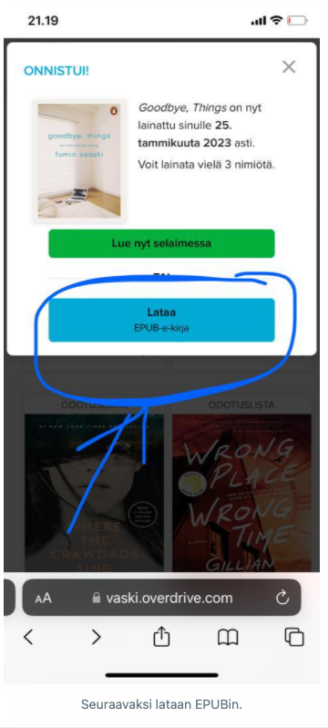
  

5.  Valitse "Download".

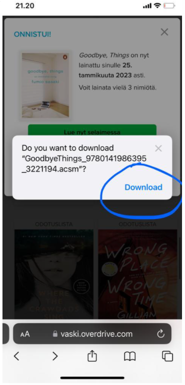
  

6.  Seuraavaksi painetaan iPhonessa Safari-näkymän alhaalla nuoleen.

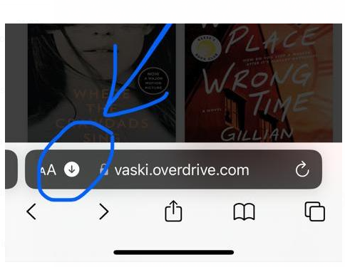
  

7.  Valitaan "Downloads".

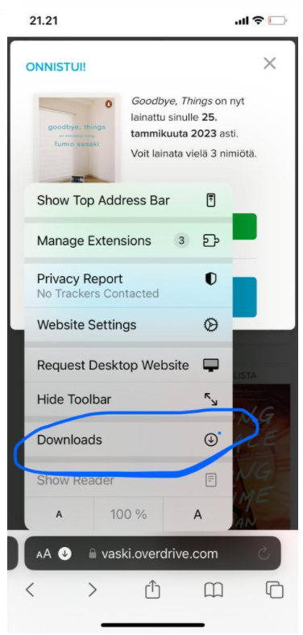
  

8.  Valitaan kirja, joka tahdotaan lukulaitteeseen siirtää.

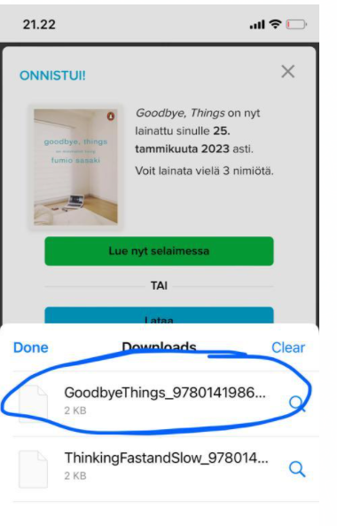
  

9.  Avautuu näkymä, jossa painetaan share-symboliin.

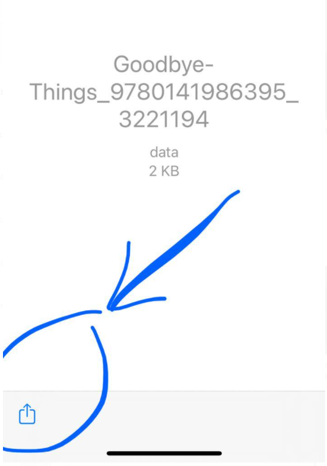
  

10. Painetaan "Save to Dropbox".

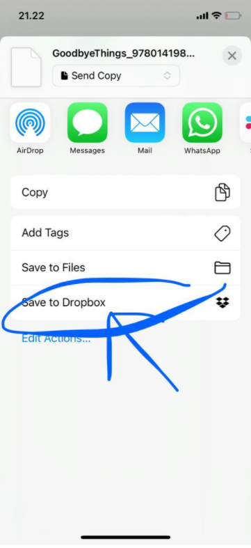
  

11. Valitaan Dropboxin sisältä hakemisto App ja sen alta...

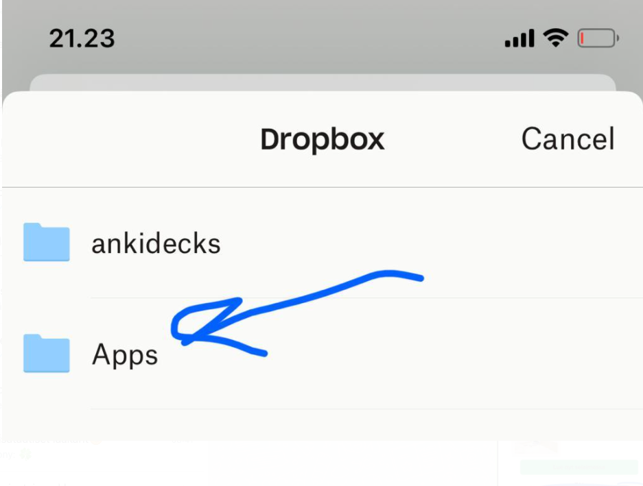

  

12. ...hakemisto Dropbox PocketBook. Tallennetaan tiedosto (= lainattu kirja) sinne.

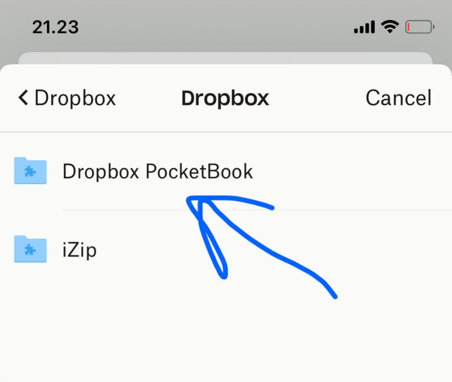
  

13. Lukulaitteen puolella valitaan "Apps" laitteen päänäkymässä.

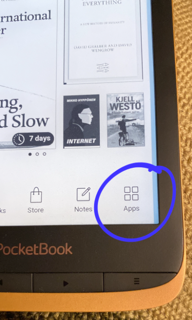
  

14. Valitaan "Dropbox PocketBook".

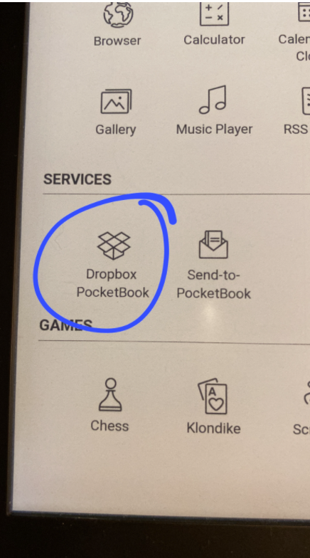
  

15. Painetaan refresh-tyyppistä kuvaketta.

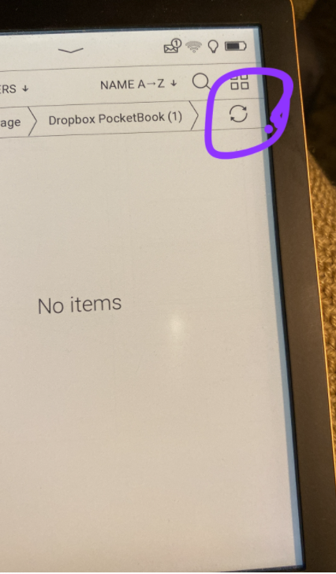
  

16. Painetaan download-tyyppistä kuvaketta.

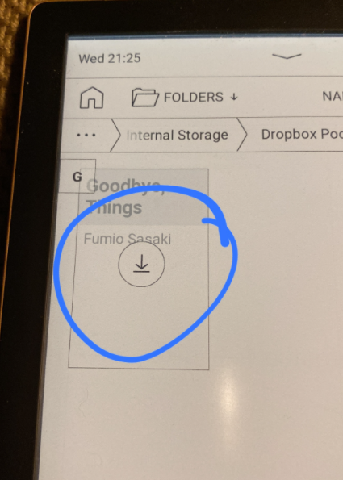
  

17. Kun mennään lukulaitteen päänäkymään, nähdään, että kirjan siirto sujui onnistuneesti.

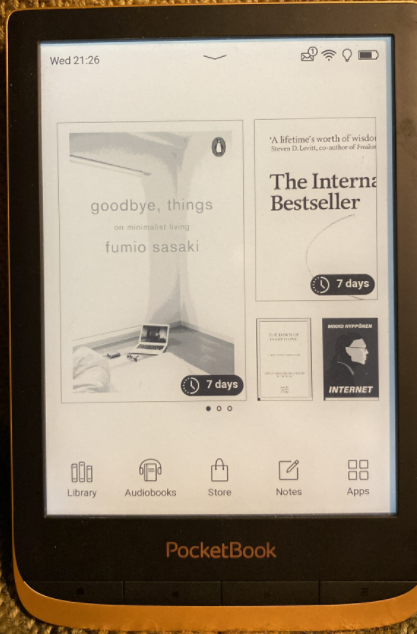
  

18. Laite ymmärtää, että kyseessä on lainattu kirja, ja ilmoittaa lainausajan asianmukaisesti.

