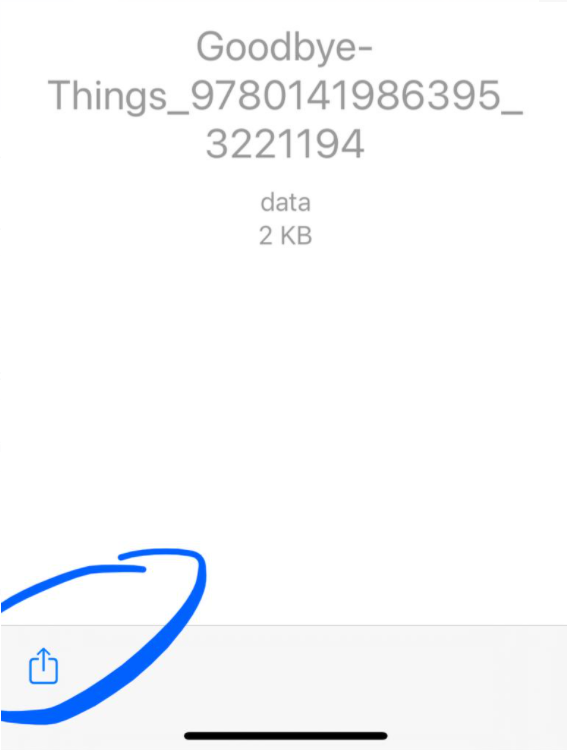

# S-postimetodi

Lainaus ja siirto tapahtuu aivan kuten yllä Dropbox-metodissa aina kohtaan 9 asti, eli tee yltä Dropbox-metodista kohdat 1-8.

Tämän jälkeen:

9.  Valitse taas share-kuvake.

  

10. Valitse tällä kertaa kuitenkin jakamisen tavaksi "Mail".

  

11. Lukulaitetta asentaessasi olet saanut pbsync.com-päätteisen s-postiosoitteen, johon voit lähettää kirjoja, jolloin ne menevät suoraan lukulaitteeseesi. Lähetä nyt kirja tähän s-postiosoitteeseesi.

  

12. Valitse laitteen päävalikosta taas "Apps" ja sen alta "Send-to-PocketBook".

  

13. Paina download-tyyppistä kuvaketta.

  

14. Kun palaat lukulaitteen päänäkymään, voit jälleen huomata, että s-postimetodillakin kirja on siirtynyt lukulaitteeseen ongelmitta.

  

15. Laite ymmärtää, että kyseessä on lainattu kirja, ja ilmoittaa lainausajan asianmukaisesti.

