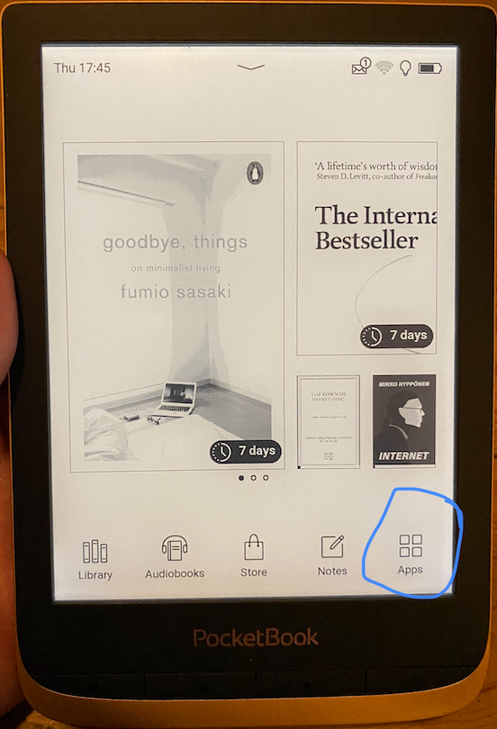
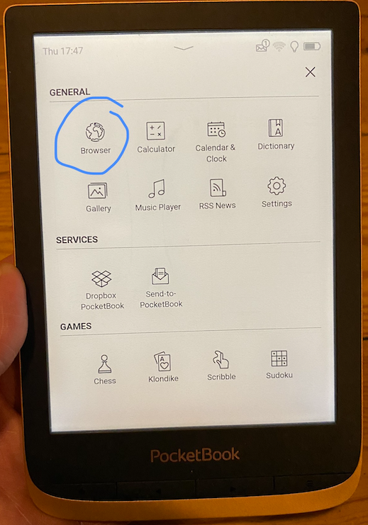
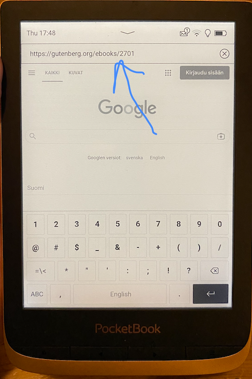
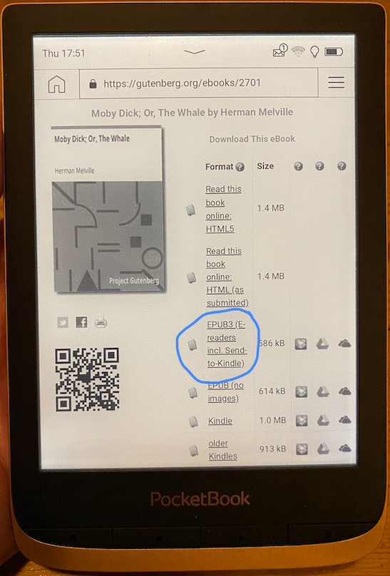
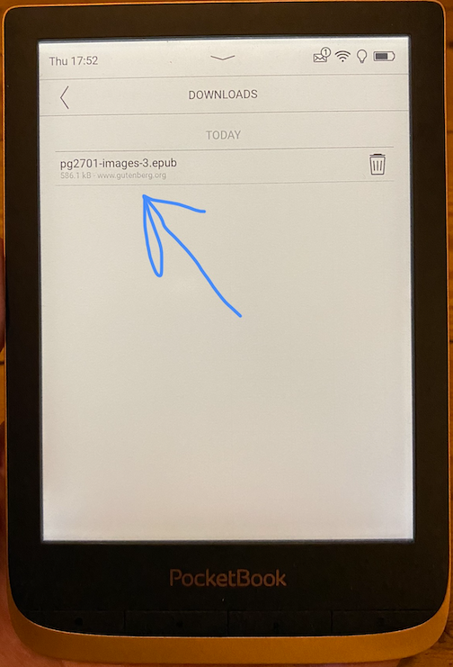
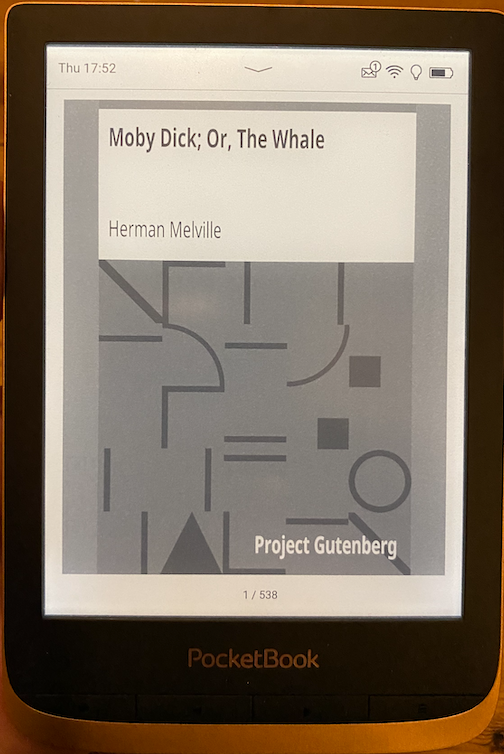

# Gutenberg-projekti ja lukulaite

Gutenberg-projektin kirjojen luku onnistuu miellyttävästi ja vaivattomasti lukulaitteella seuraavasti:

1.  Käynnistetään lukulaitteen internet-selain.
2.  Surffataan halutun kirjan kohdalle Gutenberg-projektissa.
3.  Valitaan EPUB3-muotoinen kirja.

  

Työvaiheet ovat yksityiskohtaisemmin seuraavat:

1.  Klikkaa lukulaitteen päävalikossa Apps-kuvakkeeseen.

  

2.  Klikkaa kuvakkeeseen Browser.

3.  

    

    

  

3.  Syötä haluamasi Gutenberg-projektin kirjan URL-osoite. (Huom. Lukulaitteen WWW-selain on varsin hidas, joten haen itse mieluiten kirjan URL-osoitteen ensin kännykän WWW-selaimen kanssa esiin ja kirjoitan sitten URL-osoitteen suoraan lukulaitteen selaimeen.)

  

4.  Klikkaa EPUB3-linkkiin.

  

5.  Klikkaa \*.epub-muotoisen tiedoston nimen kohdalla.

  

6.  Kirja on tämän jälkeen heti valmis luettavaksi.

